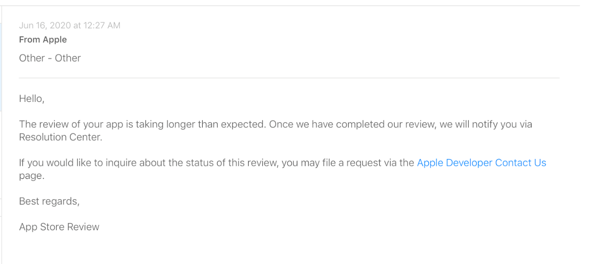

# Logboek Advanced Web & Mobile | Dzmitry Kunitski & Sasja Limpens

## Week 1
### Topics:
* Introductie (*Firebase*)
* *FriendlyChat* maken.

### Referenties:
* http://firebase.google.com/

---

## Week 2 - 3
### Topics:
* Implementatie *Google* login.

### Probleem:
Als wij de *Google* login service beginnen te implementeren, merken we op dat we niet kunnen inloggen via *Google*. Er was een probleem met *```universal-link```*.

### Oplossing:
Op de documentatie staat niet dat we eerst het commando ```cordova plugin add cordova-universal-links-plugin``` moeten uitvoeren alvorens het commando ```cordova plugin add cordova-universal-links-plugin-fix --save``` uit te voeren.

### Referenties:
* https://firebase.google.com/docs/auth/web/cordova

---

## Week 4
### Topics:
* *Cloud Firestore*

### Beschrijving:
We werken met *Cloud Firestore*. Dit is een mogelijkheid om foto’s op te laden via de klant- en medewerkerspagina.

### Referenties:
* https://firebase.google.com/docs/firestore/quickstart

---

## Week 5

### Topics:
* *Firestore* op *iOS*;
* *Framework7*.

### Beschrijving:
In deze week zijn wij vooral bezig met *Firestore* op *iOS* en *Framework7*. Tijdens het implementeren van *Firestore* zijn we tegen een probleem gebotst.

### Probleem:
Als ons *Framework7* project de plug-in *```WKWebView```* gebruikt, dan krijgen we tijdens het uitvoeren van de app een fout van *Firestore*.

### Oplossing:
De *```WKWebView```* plug-in vervangen door de *```UIWebView```* plug-in.


---

## Week 6 - 7
### Topics:
* *Firebase*

### Beschrijving:
We werken verder aan onze app. Alle gegevens van de klant en de medewerker worden opgeslagen in *Firebase* en deze worden vervolgens opgeladen in onze app. Nu kunnen we hotels toevoegen, een reservatie maken, en foto's en namen van medewerkers en klanten toevoegen aan hun profielpagina's.

---

## Week 8 - 9
### Topics:
* Het implementeren van de chat.

### Beschrijving:
Onze chat moet een verbinding leggen tussen de medewerker en de klant. De klant kan d.m.v. deze chat bij onze medewerker terecht met al zijn vragen en problemen.

---

## Week 10
### Topics:
* Probleem *```UIWebView```*.

### Probleem:
Vanaf april weigert onze app om *```UIWebView```* te gebruiken. Dit probleem ligt echter bij *Firestore* en *Framework7*: deze gebruiken namelijk de *```WKWebView```* plug-in.

### Oplossing:
We zijn ten rade gegaan bij het forum van *Framework7*. Bij het configureren van *Firestore* moeten we een paar "settings" toevoegen: 

```javascript
firebase.firestore().settings({ experimentalForceLongPolling: true });
```

In *config.xml* moeten we ook een stuk code toevoegen om onze app op *TestFlight* te kunnen opladen.

```xml
<platform name="ios">
	 …
	 <preference name="WKWebViewOnly" value="true" />
   
   <feature name="CDVWKWebViewEngine">
       <param name="ios-package" value="CDVWKWebViewEngine" />
   </feature>
   <preference name="CordovaWebViewEngine" value="CDVWKWebViewEngine" />
</platform>
```

### Referenties:
* https://forum.framework7.io/t/firebase-firestore-problem/10108/2 
* https://cordova.apache.org/howto/2020/03/18/wkwebviewonly.html

---

## Week 11
### Topics:
* App Review (opladen app).

### Probleem:
We hebben onze app naar *Apple* gestuurd voor een app review. Wij kregen van *Apple* volgend antwoord:

>Hello,
>
>Thank you for your continued patience. 
>
>We are writing to let you know that we have completed our investigation of your Apple Developer Program account. Upon further investigation, we found that your app does not comply with the following guidelines:
>
>Guideline 4.3 - Design
>
>We noticed that your app provides the same feature set as other apps submitted to the App Store; it simply varies in content or language, which is considered a form of spam.
>
>The next submission of this app may require a longer review time, and this app will not be eligible for an expedited review until this issue is resolved.
>
>Next Steps
>
>- Review the Design section of the App Store Review Guidelines.
>- Ensure your app is compliant with all sections of the App Store Review Guidelines and the Terms & Conditions of the Apple Developer Program. 
>- Once your app is fully compliant, resubmit your app for review.
>
>When creating multiple apps where content is the only varying element, you should offer a single app to deliver differing content to customers. If you would like to offer this content for purchase, it would be appropriate to use the in-app purchase API.
>
>Alternatively, you may consider creating a web app, which looks and behaves similar to a native app when the customer adds it to their Home screen. Refer to the Configuring Web Applications section of the Safari Web Content Guide for more information.
>
>Submitting apps designed to mislead or harm customers or evade the review process may result in the termination of your Apple Developer Program account. Review the Terms & Conditions of the Apple Developer Program to learn more about our policies regarding termination.
>
>All apps submitted to the App Store are reviewed against the App Store Review Guidelines, including the Developer Code of Conduct. If we find any issues during our review, your account will be re-investigated. In order to avoid future investigations, please ensure your apps don't attempt to mislead or harm customers or undermine the review process.
>
> We hope you will consider making the necessary changes to be in compliance with the App Store Review Guidelines and will resubmit your revised binary.
>
> Best regards,
>
> App Store Review

Tot op heden staat onze app nog altijd niet in de *App Store*. Eerder haalde *Apple* al aan dat we gebruik maakten van verouderde API’s. We moesten de *```UIWebView```* plug-in niet meer gebruiken en moesten deze vervangen door de *```WKWebView```* plug-in. Dit deden we ook.

*Apple* klaagde ook al dat onze app te veel lijkt op andere apps. We kunnen al raden welke dit zullen zijn: *[Hotel Trivago](https://apps.apple.com/be/app/trivago-compare-hotel-prices/id376888389)* en *[Hotel Tonight: Hotelkortingen](https://apps.apple.com/nl/app/hotel-tonight-hotelkortingen/id407690035)*. In tegenstelling tot wat *Apple* denkt richten wij ons niet op vakantiegangers, maar op hoteleigenaars. We bieden zelfs geen hotels tegen kortingen aan, hoewel we wel kunnen vatten hoe de verwarring is ontstaan. Dit probleem is reeds van de baan.



Recent zegt *Apple* dat de review langer duurt dan verwacht. Wij kunnen momenteel niets anders doen dan de situatie nauw op te volgen en het resultaat af te wachten.
